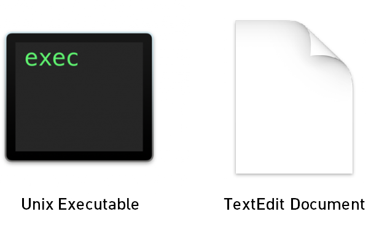
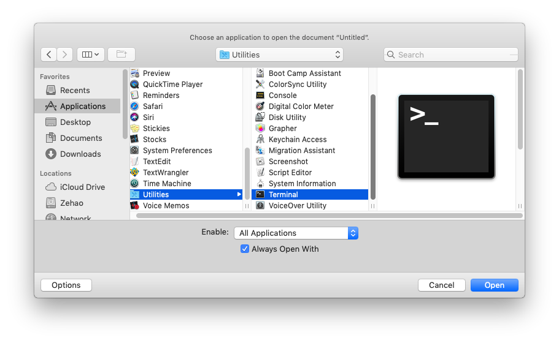
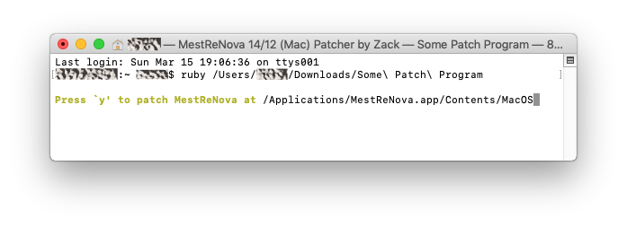
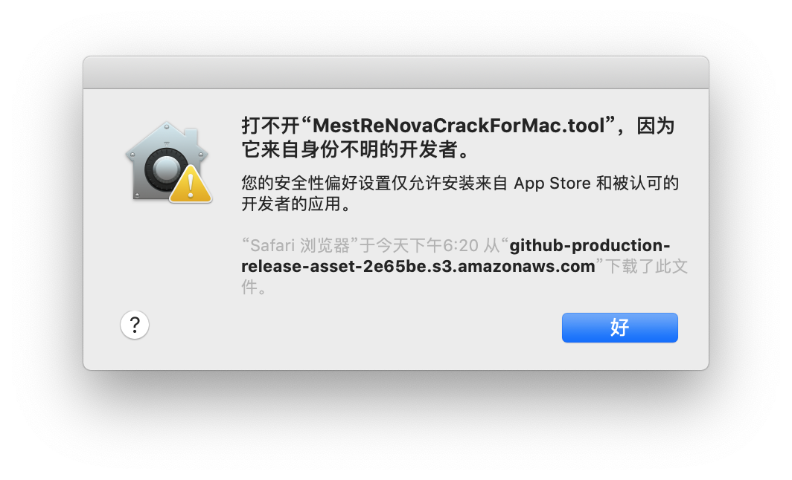
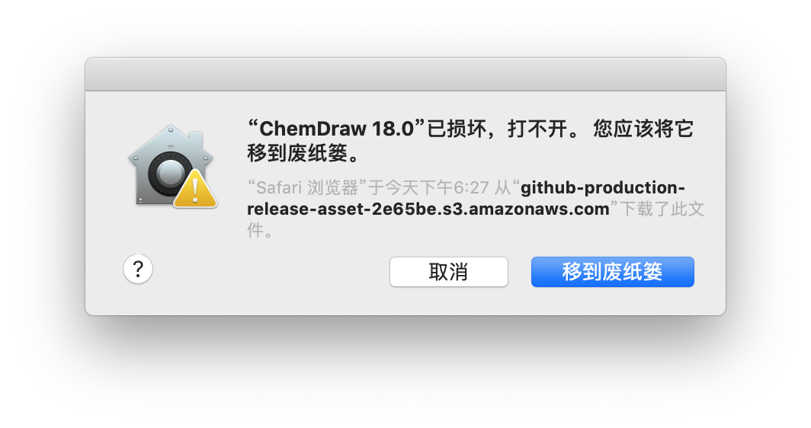

# Mac OS下软件补丁的一般操作流程及疑难解答

在Mac OS下，系统对运行不受信任程序的审查比Windows更加严格。因此根据一些用户的反映，按照推文中的操作进行补丁破解后常常会收到各种各样的系统错误提示。本文旨在介绍一种通用的绕过Mac OS gatekeeper验证的方法（以及如果遇上某些已知错误时，一些更麻烦的后备方案）。

## 一般操作流程

Mac OS对Internet上下载的文件特别谨慎，会阻止源代码的执行及验证安装包签名。相反，对存储介质（U盘等）拷贝过来的则“网开一面”。因此，尽量避免直接网上下载，而是“曲线救国”：
* 在另一台**Windows电脑**上下载好.dmg程序镜像包 **以及** 补丁文件
* 把它们通过U盘拷贝到Mac电脑上
* 正常安装软件
* 进行补丁操作（下述两者 **之一**）

  * 对于替换补丁：

    * 右键“显示包内容”，按照说明替换目标文件 **或者**
  * 对于补丁程序：

    * 确保其文件类型为 **“可执行文件 (executable)”** （图标显示为下图左侧样式）而非文本文档，否则参照[补丁程序无“可执行”标志](MAC.md#补丁程序无可执行标志)一节方法解决

    * 确保用“实用工具 (Utilities) / **终端 (Terminal)**”方式打开（如下图所示（如果“终端”为灰色不可选，点击“选项”，选择“所有应用”））

* 按照上述操作结束后，理论上应该可以正常打开并运行软件了。如果有任何错误提示，请参照“疑难解答”。

## 疑难解答
### 补丁程序无法运行的通用备用方案

* 通过LauchPad打开一个“**终端 (Terminal)**”窗口，输入`ruby `，注意在字母y后**还有一个空格（非常重要！）**，然后将访达 (Finder)中的补丁程序文件拖拽至终端窗口中（将会补全其路径，结果如下图所示），最后回车运行即可

### 补丁程序无“可执行”标志

* 图标显示为文本文档（“TextEdit Document”），此时有两种解决方案（采取下述两者 **之一** 即可）：

  * [补丁程序无法运行的通用备用方案](MAC.md#补丁程序无法运行的通用备用方案) **或者：**
  * 打开一个终端 (Terminal)窗口，输入`chmod +x `（注意末尾空格），拖入程序文件或输入其路径，回车。此时补丁程序文件已打上“可执行”标志（图标变为黑框+exec），用终端打开它即可

### 补丁程序双击打开却显示文本编辑器

* 可以采用[补丁程序无法运行的通用备用方案](MAC.md#补丁程序无法运行的通用备用方案)，**或者** 改变应用默认打开方式为**终端 (Terminal)**

### 补丁程序弹出“不明开发者”错误

* 如上图，此时可参考[补丁程序无法运行的通用备用方案](MAC.md#补丁程序无法运行的通用备用方案) **或者** 在另一台Windows电脑上下载好，然后把它通过U盘拷贝到Mac电脑上运行

### 软件弹出“已损坏”错误

* 如上图，此时先回滚一切操作。此时有两种解决方案（采取下述两者 **之一** 即可）：
  * 可以在执行补丁之前，先运行一遍未破解的程序，完成“**正在验证 (Verifying)**”过程，然后再执行补丁；**或者：**
  * 在另一台Windows电脑上下载好，然后把它通过U盘拷贝到Mac电脑上运行

### 其他方案

其他方案或者更加麻烦（手动复制粘贴存代码、或者去除数字签名），或者降低系统安全性（允许“任何来源”）。作者不打算深入讨论，感兴趣的可以自行上网搜索（比如，[此文](https://www.cnblogs.com/vdesign/p/12427700.html)）。或者你可以开启一个[Issue](https://github.com/Z-H-Sun/CS_CCME_Posts/issues)